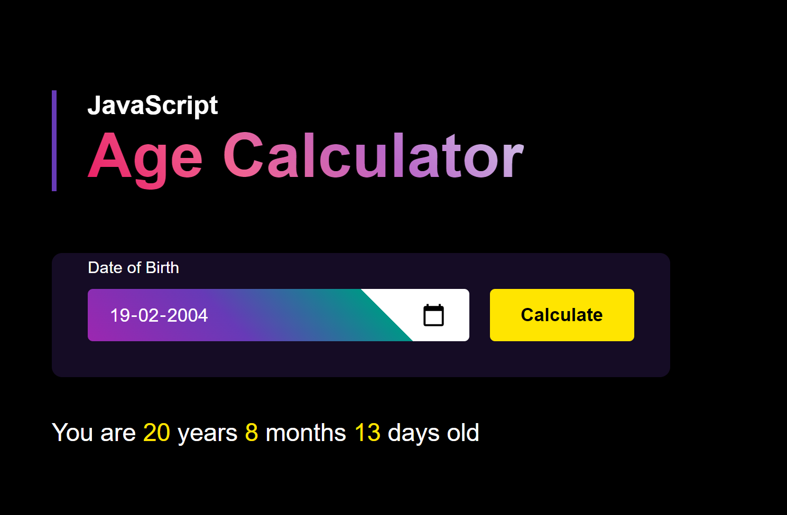

# Age Calculator

A simple and interactive Age Calculator app that takes a date input from the user and calculates their age in years, months, and days. This app is built using **HTML**, **CSS**, and **JavaScript**, making it easy to use on any device.

## Features

- **Date Input**: Users can input their birthdate.
- **Calculate Age**: Calculates age accurately in years, months, and days.
- **User-Friendly Interface**: Simple and intuitive design for ease of use.

## Demo

Check out the live demo of the project [here](https://sanskargupta0.github.io/Age-Calculator/).




## Installation and Setup

1. Clone the repository or download the source code:
    ```bash
    git clone https://github.com/Sanskargupta0/Age-Calculator.git
    ```

2. Navigate to the project folder:
    ```bash
    cd age-calculator
    ```

3. Open `index.html` in your web browser:
    ```bash
    open index.html
    ```

## Usage

1. **Input Date**: Enter your birthdate in the provided date input field.
2. **Calculate Age**: Click the "Calculate Age" button to see your age displayed in years, months, and days.

